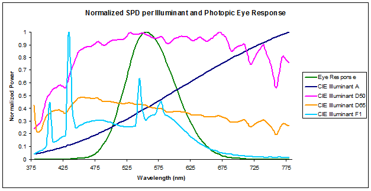
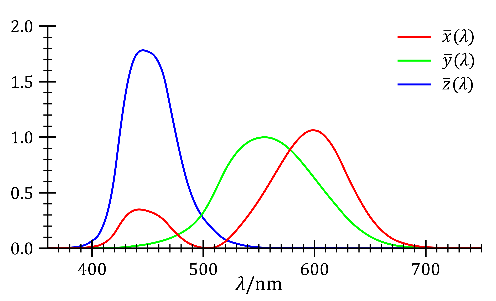
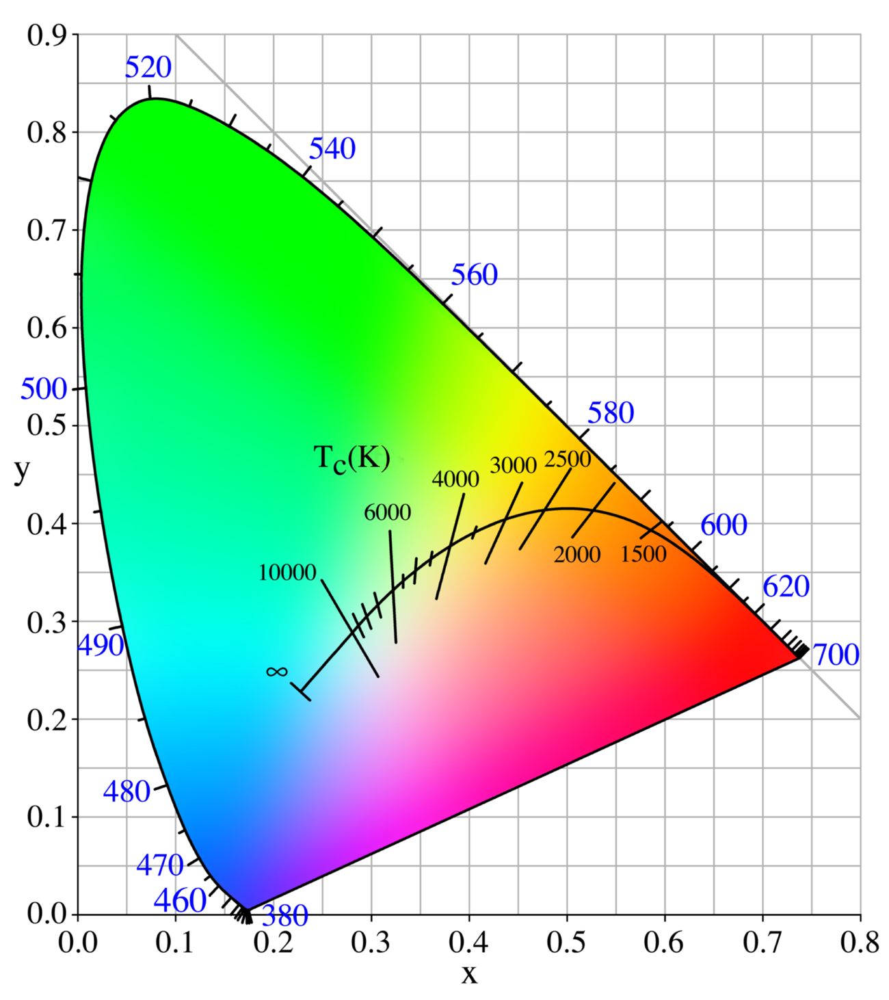
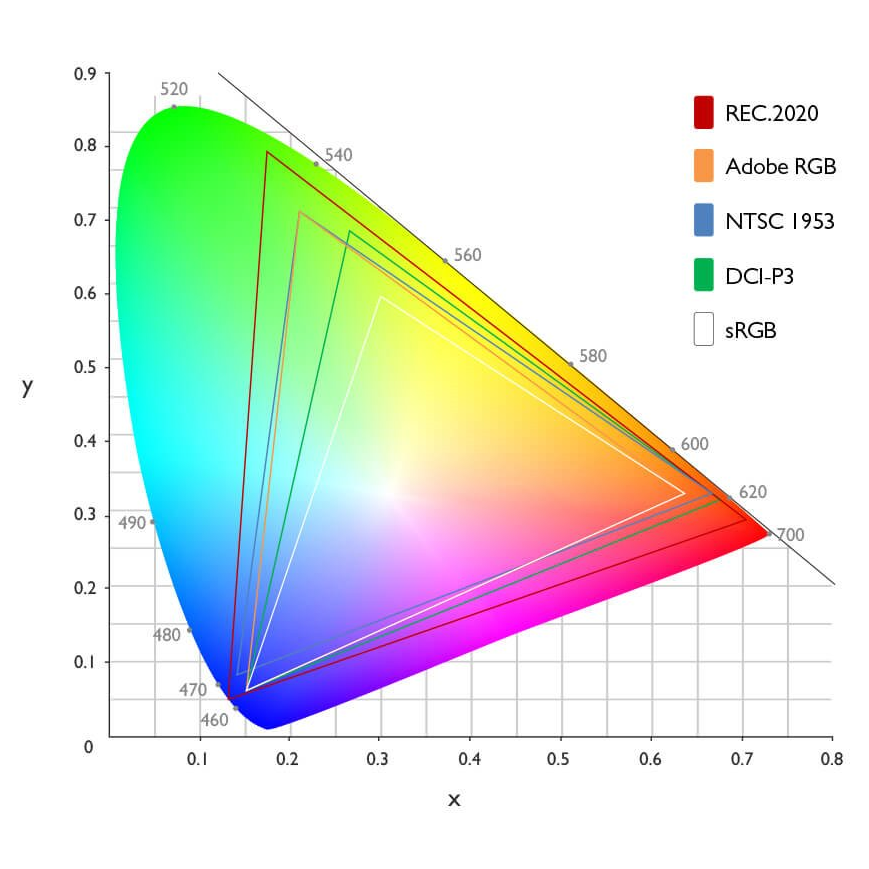
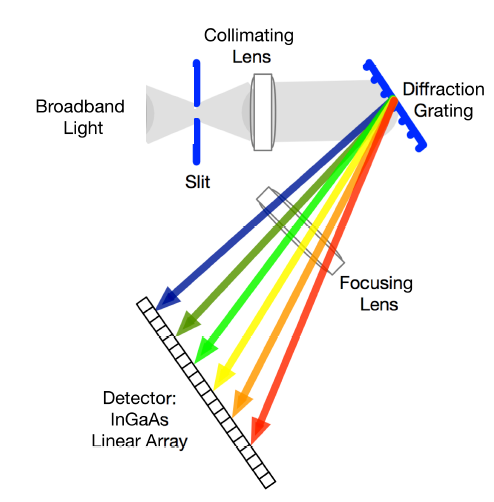

# Calibrating RGB leds so they output approximately what you expect

The problem I'm trying to solve here is if you take a LED strip such as a ws2812 or sk6812 etc, and you program it to show a specific RGB value, the color it produces is very often very different from how that color code looks on your computer monitor. If you set them to `rgb(255, 255, 255)` they do not produce very clean white. If you set them to orange (`rgb(255, 127, 0)`) they don't really produce orange, and if you set them to anything that looks brown on the computer, the output is definitely not brown.

So can you in software calibrate this and actually have the strips output clean white, orange, brown etc? What we want is basically modifying each RGB value before sending it to the strip, so that the strip actually outputs something close to how the original input RGB is supposed to look.

Turns out there is no clear start-to-finish guide for this on the internets. At least not from what I can find. There are many different guides and videos explaining different topics. There are also guides that intend to explain LED color calibration, but they are hand wavy around the most important steps involved. This guide aims to solve that. It does that by first introducing the required concepts from colorimetry, and then step by step showing how to measure your LEDs and calibrate them.

# Colorimetry theory and vocabulary

### Spectral power distribution

A spectral power distribution (SPD for short) is a function, $M(\lambda)$, where $\lambda$ is the wavelength of the light in nanometer, and the value of the function is the intensity of the light at that wavelength.

See [Spectrometer](#spectrometer) and [Spectroradiometer](#spectroradiometer) for how to measure these from real light sources.

### Tristimulus values - CIE XYZ

The CIE XYZ color space encompasses all color sensations that are visible to a person with average eyesight. That is why CIE XYZ (Tristimulus values) is a device-invariant representation of color.[5] It serves as a standard reference against which many other color spaces are defined.

Consider two light sources composed of different mixtures of various wavelengths. Such light sources may appear to be the same color; this effect is called "metamerism." Such light sources have the same apparent color to an observer when they produce the same tristimulus values, regardless of the spectral power distributions of the sources.

#### Meaning of X, Y and Z

In the CIE 1931 model, Y is the luminance, Z is quasi-equal to blue (of CIE RGB), and X is a mix of the three CIE RGB curves chosen to be nonnegative (see § Definition of the CIE XYZ color space). Setting Y as luminance has the useful result that for any given Y value, the XZ plane will contain all possible chromaticities at that luminance.

The unit of the tristimulus values X, Y, and Z is often arbitrarily chosen so that Y = 1 or Y = 100 is the brightest white that a color display supports. In this case, the Y value is known as the relative luminance. The corresponding whitepoint values for X and Z can then be inferred using the standard illuminants.

#### Color matching functions

The CIE's color matching functions $\overline{x}(\lambda)$, $\overline{y}(\lambda)$ and $\overline{z}(\lambda)$ are the numerical description of the chromatic response of some "observer". They can be thought of as the spectral sensitivity curves of three linear light detectors yielding the CIE tristimulus values X, Y and Z. Collectively, these three functions describe the CIE standard observer.

#### Computing XYZ from spectral data

Given a [spectral power distribution](#spectral-power-distribution), $M(\lambda)$, and three color matching functions, the X, Y and Z values are computed as the sum multiplying the SPD value with each color matching function respectively:

$$\begin{align}
X &= \int_\lambda M(\lambda)\,\overline{x}(\lambda)\,d\lambda, \\
Y &= \int_\lambda M(\lambda)\,\overline{y}(\lambda)\,d\lambda, \\
Z &= \int_\lambda M(\lambda)\,\overline{z}(\lambda)\,d\lambda
\end{align}$$

where $\lambda$ is the wavelength of the equivalent monochromatic light (measured in nanometers), and customary limits of the integral are $\lambda\in[380, 780]$ (visible light spectrum).

### Standard illuminant

A standard illuminant is a theoretical source of visible light with a [spectral power distribution](#spectral-power-distribution) that is published. Standard illuminants provide a basis for comparing images or colors recorded under different lighting.

The International Commission on Illumination (usually abbreviated CIE for its French name) is the body responsible for publishing all of the well-known standard illuminants. Each of these is known by a letter or by a letter-number combination.

https://en.wikipedia.org/wiki/Standard_illuminant

#### Illuminant D65

The D series of illuminants defined by the CIE attempts to simulate the spectral power distribution of natural daylight. D65 more specifically is a standard Illuminant roughly corresponding to the color temperature of the sky on a clear day around noon in northern Europe. D65 is very close to the color temperature 6500K, but they are not equal!

D65 is the standard illuminant we'll be using in this guide to calibrate the white point of the LEDs. Simply because it is the industry standard, and the color output most computer monitors attempt to output when set to `rgb(255, 255, 255)`.

The chromaticity coordinates of D65 are `(0.31271, 0.32902)`.

Source: https://www.waveformlighting.com/color-matching/what-is-d65-and-what-is-it-used-for

### White point

To be written

### CIE xyY color space - chromaticity

The concept of color can be divided into two parts: brightness and chromaticity. For example, the color white is a bright color, while the color grey is considered to be a less bright version of that same white. In other words, the chromaticity of white and grey are the same while their brightness differs. 

The [CIE XYZ color space](#tristimulus-values---cie-xyz) was deliberately designed so that the Y parameter is also a measure of the luminance of a color. The chromaticity is then specified by the two derived parameters x and y, two of the three normalized values being functions of all three tristimulus values X, Y, and Z:

$$\begin{align}
x &= \frac{X}{X+Y+Z} \\
y &= \frac{Y}{X+Y+Z} \\
z &= \frac{Z}{X+Y+Z} = 1 - x - y
\end{align}$$

That is, because each tristimulus parameter, X, Y, Z, is divided by the sum of all three, the resulting values, x, y, z, each represent a proportion of the whole and so their sum must be equal to one. Therefore, the value z can be deduced by knowing x and y, and consequently the latter two values are sufficient for describing the chromaticity of any color.

The derived color space specified by x, y, and Y is known as the CIE xyY color space and is widely used to specify colors in practice.

The X and Z tristimulus values can be calculated back from the chromaticity values x and y and the Y tristimulus value:

$$\begin{align}
X &= \frac{Y}{y}x, \\
Z &= \frac{Y}{y}(1 - x - y).
\end{align}$$

### Chromaticity diagram

Chromaticity consists of the hue and saturation of light, and does not include its luminance/brightness. The chromaticity diagram represents all the chromaticities visible to the average person. It is called the gamut of human vision. Each color is defined by a pair of coordinates, x and y. These are called the chromaticity coordinates.

The first image shows the CIE 1931 xy chromaticity space, also showing the chromaticities of black-body light sources of various temperatures, or more photographically explained as white temperatures.

The second image shows the CIE 1931 xy chromaticity space, including some common industry standard color gamuts, such as sRGB, DCI-P3 etc.

The curved edge of the gamut is called the *spectral locus* and corresponds to monochromatic light (each point representing a pure hue of a single wavelength). In the images you can see that the light wavelengths are printed along the curve. The straight edge on the lower part of the gamut is called the line of purples. These colors, although they are on the border of the gamut, have no counterpart in monochromatic light. Less saturated colors appear in the interior of the figure with white at the center.

A straight line between any two points on the diagram shows all the colors that can be produced by mixing these two colors. So linear interpolation can be used to smoothly fade between any two colors. If we extend this concept to three points in the diagram, we get a triangle. This triangle is called a **color gamut**. The area inside the gamut shows/contains all the colors that can be made from mixing the three colors of the corners of the triangle.

An equal mixture of two equally bright colors will not generally lie on the midpoint of that line segment. In more general terms, a distance on the CIE xy chromaticity diagram does not correspond to the degree of difference between two colors. The CIE 1960, CIE 1964, and CIE 1976 color spaces were developed, with the goal of achieving perceptual uniformity (have an equal distance in the color space correspond to equal differences in color). Although they were a distinct improvement over the CIE 1931 system, they were not completely free of distortion.

Light with a flat power spectrum in terms of wavelength (equal power in every 1 nm interval) corresponds to the point `(x, y) = (1/3, 1/3)`.

Given the shape of the chromaticity diagram, we can see that no single triangle can cover all of the surface. As a result, no color gamut can produce all possible colors. The corners of the diagram are more or less red, green and blue, so using these three base colors to form a color gamut covers the biggest area of the diagram. However, LEDs and monitors are further limited by the fact that it is technically difficult to produce things which emits pure spectral colors along the edges of the diagram.

Sources:
https://www.youtube.com/watch?v=O0nYJ0Mjx10

### RGB color space

To be written/figured out how to go from CIE xyY <-> RGB.

### Spectrometer

A spectrometer measures *relative* intensity of light as a function of wavelength. A diffraction grating normally in the reflection geometry is used to disperse the light onto a CCD camera. Each pixel will receive a small bandwidth of the incoming radiation.

The output of a spectrometer is a *relative* [spectral power distribution](#spectral-power-distribution).

You can actually make a decent makeshift spectrometer with a DVD as a jitter, a webcam as sensor and a slit in a black box to capture light in only one direction. There are a bunch of tutorials and videos for this online. Here are a few:

https://hackaday.io/project/28529-portable-dvd-spectroscope
https://www.youtube.com/watch?v=MgogwcXUIoc

### Spectroradiometer

A spectroradiometer is a spectrometer with light intensity calibration. So the measured light at each wavelength will have a unit associated with it instead of just being relative to the other wavelengths. This unit could be radiometric such as Watts/m2 or photometric such as Lux.

This tool is needed to fully measure light and compute its XYZ values. However, these tools are prohibitively expensive, and in the end, we don't really need the intensity of the light to compute the chromaticity differences we need to calibrate the LEDs.

### Photometer/Radiometer

Measures total light illuminance (lux) or radiance (watts/m^2). So it only measures the intensity of light, not what color it is or consists of. We have no use for these in this guide. I just wanted to mention the term since there are so many gadgets with very confusingly similar names.

Sources:

https://www.alliedscientificpro.com/blog/welcome-to-our-blogs-1/spectrometer-spectro-radiometer-spectro-photometer-photometer-radiometer-what-is-the-difference-115

## Performing color calibration

Color calibration of a monitor or a single LED boils down to two separate calibrations:
1. White point calibration and
2. Color gamut calibration

First you must build/obtain a [spectrometer](#spectrometer). Because you will need to analyze the spectrum of light produced by the LEDs to be able to know what they actually output.

### White point calibration

First define a target color point. We'll use [Illuminant D65](#illuminant-d65) as it is an industry standard for this. And we define it in RGB as $R_{expect} = 1.0, G_{expect} = 1.0, B_{expect} = 1.0$.

Then program the LEDs to output the RGB code that I *want* to match my target color point. In this case this is full on on all channels (`rgb(255, 255, 255)`).

Now measure the spectrum that the LEDs output with the spectrometer and obtain a relative [SPD](#spectral-power-distribution).

Compute the CIE XYZ values for the spectrum and then from that the CIE xyY coordinates and from that the RGB values. The Y here will be nonsensical since we only have a relative SPD. So the same holds for RGB, the absolute values for each color channel has no value, only their relationship to each other. But we only care about the chromaticity anyway, so this is fine! We call these $R_{actual}, G_{actual}, B_{actual}$. *[Open question I don't have the answer to yet: Can I just skip the CIE XYZ -> CIE xyY steps. There are color matching functions for RGB that goes directly from SPD -> RGB. Are these equally good?]*

Compute compensation factors ($C_{r/g/b}$) for each color channel to make their actual output equally strong. The compensation factors above are the factors you would need to multiply your desired RGB values with before sending them to the LEDs in order to have them output something close to the chromaticity of the RGB value you expected:

$$\begin{align}
C_r &= \frac{R_{expect}}{R_{actual}},\\
C_g &= \frac{G_{expect}}{G_{actual}},\\
C_b &= \frac{B_{expect}}{B_{actual}},\\
\end{align}$$

In order to avoid clipping (all output values are already set to their max), we need to make sure all these factors stay in the range $[0, 1]$ but keep their relationship. This means we need to scale down the two brightest channels to match the dimmest channel. Find the largest compensation factor: $C_{max} = max(C_r, C_g, C_b)$. Scale down all compensation factors with the largest value:

$$\begin{align}
C_{sr} = C_r / C_{max},\\
C_{sg} = C_g / C_{max},\\
C_{sb} = C_b / C_{max},\\
\end{align}$$

Now add $C_{sr}, C_{sg}, C_{sb}$ to your program code and scale all your RGB values with these constants before sending the the value off to the LEDs. Now they should be white point calibrated. Meaning that when you try to emit white, it should actually be pretty close to a the light from the sun on a clear day at noon.

#### Example

You measure a relative SPD that gives you the RGB values:

$$\begin{align}
R_{actual} &= 0.9,\\
G_{actual} &= 0.8,\\
B_{actual} &= 0.7,
\end{align}$$

We get the compensation factors:

$$\begin{align}
C_r &= 1.0/0.9 = 1.111...,\\
C_g &= 1.0/0.8 = 1.25,\\
C_b &= 1.0/0.7 = 1.429...,\\
\end{align}$$

And we scale them:

$$\begin{align}
C_{max} &= max(C_r, C_g, C_b) = 1.429...,\\
C_{sr} &= C_r / C_{max} = 0.778...,\\
C_{sg} &= C_g / C_{max} = 0.875,\\
C_{sb} &= C_b / C_{max} = 1.0,\\
\end{align}$$

So to whitepoint calibrate your RGB values is software before sending them to the actual LED you need to multiply the red channel value with 0.778 and the green channel value with 0.876.

### Color gamut calibration

To be written

Sources:
https://www.led-professional.com/resources-1/articles/avoiding-brightness-and-color-mismatch-with-proper-rgb-gamut-calibration